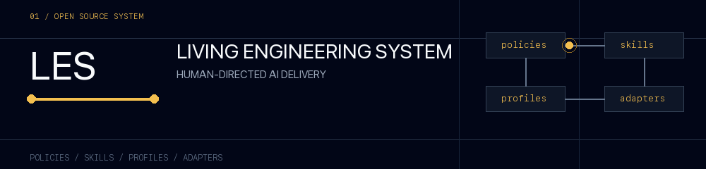
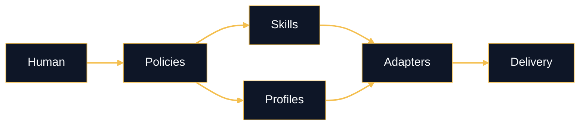

<p align="center">
  <picture>
    <source media="(prefers-reduced-motion: reduce)" srcset="./les-banner.svg">
    
  </picture>
</p>

<p align="center">
  <a href="https://github.com/hakienit/les">Source</a> ·
  <a href="https://www.npmjs.com/package/@hakienit/les">npm package</a> ·
  <a href="https://www.linkedin.com/in/ikeha/">LinkedIn</a>
</p>

# Kien Ha · Ike Ha

### Software engineer building practical products with modern JavaScript.

I work across frontend and backend, with a focus on React, Next.js, ElectronJS,
and Node.js. I make software easier to understand, operate, and review. My current focus is
[LES](https://github.com/hakienit/les), a provider-neutral engineering
methodology for delivering software with AI.

Based in Da Nang, Vietnam.

## At a glance

| | |
| --- | --- |
| Current focus | [LES — Living Engineering System](https://github.com/hakienit/les) |
| Runtime | Node.js 20+ |
| Interface | CLI + Markdown |
| License | MIT |
| Package | [`@hakienit/les`](https://www.npmjs.com/package/@hakienit/les) |

## Professional snapshot

Software engineer with experience building user-facing products and full-stack
JavaScript applications. I care about interfaces that feel clear, systems that
are practical to operate, and tools that help people do better work.

### Experience

| Role | Organization | Period |
| --- | --- | --- |
| Frontend Developer | Vinova Pte. Ltd. | Mar 2022 - Present |
| Software Frontend Engineer | Freelance | May 2020 - Present |

**Top skills:** Generative AI · Full-stack development · Front-end development

**[View my LinkedIn profile](https://www.linkedin.com/in/ikeha/)**

## The flagship project

### LES gives AI-assisted projects a shared operating system.

AI tools become easier to trust when a project has one visible place for its
rules and operating model. LES keeps the pieces small and explicit:

| Layer | Job |
| --- | --- |
| **Policies** | Own the behavior and precedence. |
| **Skills** | Expose repeatable operations. |
| **Profiles** | Add optional domain rules. |
| **Adapters** | Route the same workflow across AI hosts. |



<details>
  <summary><strong>Install once. Use across repositories.</strong></summary>

  ```sh
  npx -y @hakienit/les

  cd my-project
  les init
  les active codex
  ```
</details>

<p>
  <a href="https://github.com/hakienit/les#readme">Read the documentation</a> ·
  <a href="https://github.com/hakienit/les/releases">See releases</a> ·
  <a href="https://github.com/hakienit/les/issues">Open an issue</a>
</p>

## What I care about

- Clear systems over clever systems
- Human direction with useful automation
- Small tools that are easy to adopt and maintain
- Documentation that explains the reason, not only the command

## Tools I reach for

`JavaScript` · `Node.js` · `React` · `Next.js` · `ElectronJS` · `CLI tooling` · `Markdown` · `AI workflows`

### Tech stack

<p>
  
</p>
